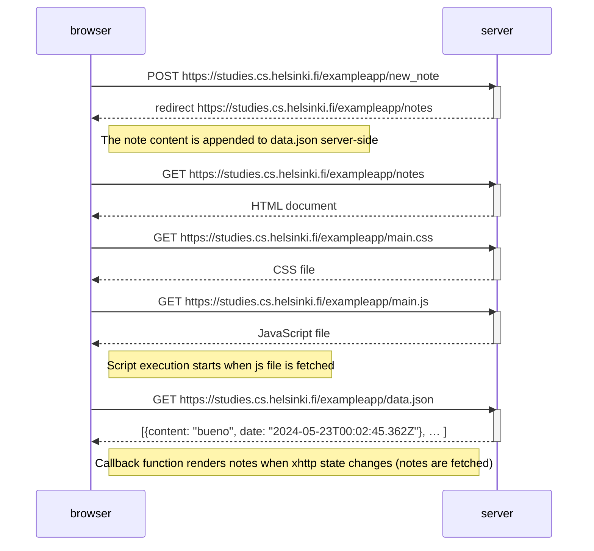

```mermaid
sequenceDiagram
    participant browser
    participant server

    browser ->> server: POST https://studies.cs.helsinki.fi/exampleapp/new_note
    activate server
    server -->> browser: redirect https://studies.cs.helsinki.fi/exampleapp/notes
    deactivate server

    Note right of browser: The note content is appended to data.json server-side

    browser ->> server: GET https://studies.cs.helsinki.fi/exampleapp/notes
    activate server
    server -->> browser: HTML document
    deactivate server

    browser ->> server: GET https://studies.cs.helsinki.fi/exampleapp/main.css
    activate server
    server -->> browser: CSS file
    deactivate server

    browser ->> server: GET https://studies.cs.helsinki.fi/exampleapp/main.js
    activate server
    server -->> browser: JavaScript file
    deactivate server

    Note right of browser: Script execution starts when js file is fetched

    browser ->> server: GET https://studies.cs.helsinki.fi/exampleapp/data.json
    activate server
    server -->> browser: [{content: "bueno", date: "2024-05-23T00:02:45.362Z"}, … ]
    deactivate server

    Note right of browser: Callback function renders notes when xhttp state changes (notes are fetched)
```