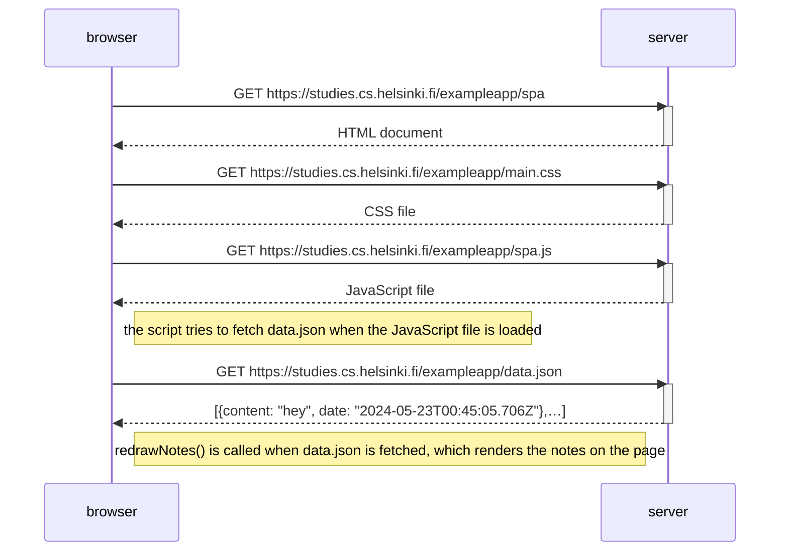

```mermaid
sequenceDiagram
    participant browser
    participant server

    browser ->> server: GET https://studies.cs.helsinki.fi/exampleapp/spa
    activate server
    server -->> browser: HTML document
    deactivate server

    browser ->> server: GET https://studies.cs.helsinki.fi/exampleapp/main.css
    activate server
    server -->> browser: CSS file
    deactivate server

    browser ->> server: GET https://studies.cs.helsinki.fi/exampleapp/spa.js
    activate server
    server -->> browser: JavaScript file
    deactivate server

    Note right of browser: the script tries to fetch data.json when the JavaScript file is loaded

    browser ->> server: GET https://studies.cs.helsinki.fi/exampleapp/data.json
    activate server
    server -->> browser: [{content: "hey", date: "2024-05-23T00:45:05.706Z"},…]
    deactivate server

    Note right of browser: redrawNotes() is called when data.json is fetched, which renders the notes on the page
```