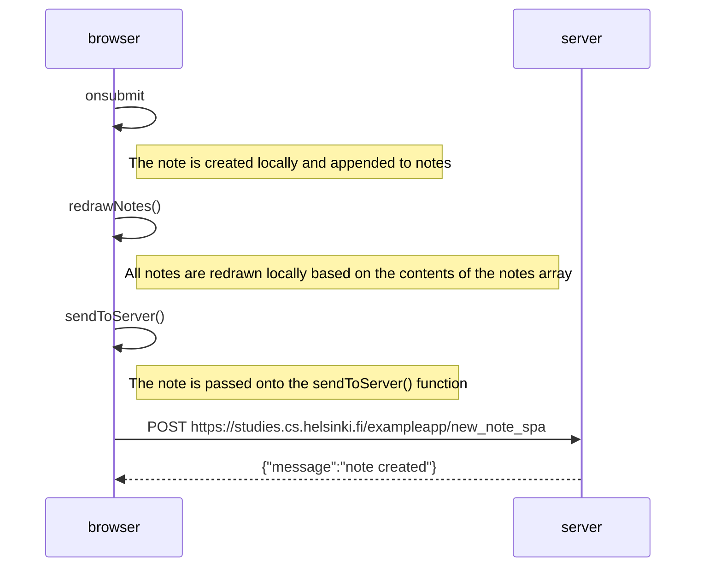

```mermaid
sequenceDiagram
    participant browser
    participant server

    browser ->> browser: onsubmit

    Note right of browser: The note is created locally and appended to notes

    browser ->> browser: redrawNotes()

    Note right of browser: All notes are redrawn locally based on the contents of the notes array

    browser ->> browser: sendToServer()

    Note right of browser: The note is passed onto the sendToServer() function

    browser ->> server: POST https://studies.cs.helsinki.fi/exampleapp/new_note_spa
    server -->> browser: {"message":"note created"}
```